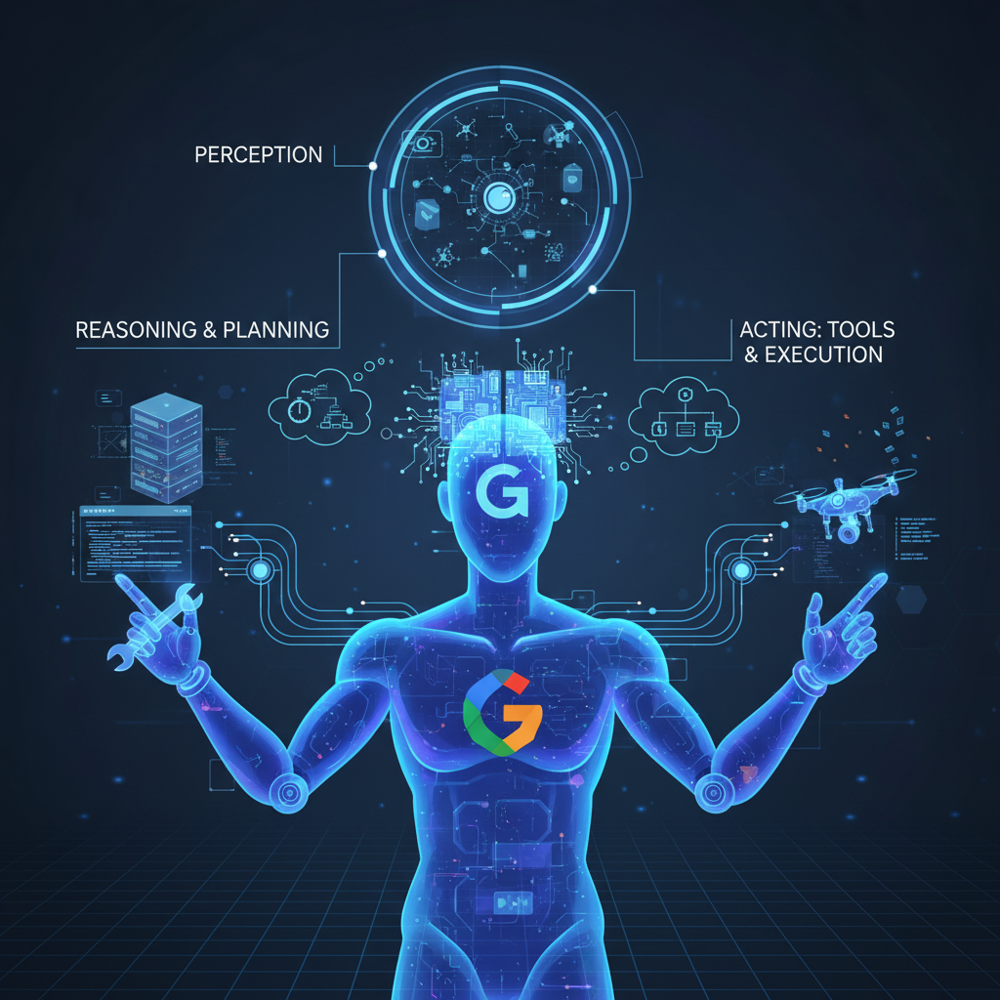

# Module 1: Introduction to AI Agents

# Module 1: Introduction to AI Agents & Google ADK

## Theory

### The Rise of AI Agents

In the rapidly evolving landscape of artificial intelligence, we are moving beyond simple chatbots and predictive models. The next frontier is **AI Agents**: autonomous systems that can understand goals, make plans, and use tools to interact with their environment to accomplish complex tasks.

Unlike traditional programs that follow a rigid set of instructions, an agent can reason, adapt, and act on its own. This paradigm shift is powered by the sophisticated reasoning capabilities of Large Language Models (LLMs) like Google's Gemini.

### What is an AI Agent?

An AI Agent is a system that can:

1.  **Perceive its environment:** It takes in information, such as a user's request in natural language.
2.  **Reason and Plan:** It uses an LLM as its "brain" to break down a high-level goal into a sequence of smaller, actionable steps.
3.  **Act using Tools:** It executes those steps by interacting with its environment. This could mean calling an API, searching a database, running a piece of code, or even using another agent.
4.  **Observe the Outcome:** It analyzes the results of its actions and adjusts its plan accordingly until the goal is achieved.

Think of an agent as an autonomous worker that you can delegate complex tasks to, moving from just "chatting" with an AI to collaborating with it.

### Introducing the Google Agent Development Kit (ADK)

Building robust, production-ready AI agents is a complex task. It involves much more than just prompting an LLM. You need to manage conversation history, handle tool integrations, orchestrate complex workflows, evaluate performance, and deploy the agent to a scalable infrastructure.

The **Google Agent Development Kit (ADK)** is a comprehensive framework designed to solve these challenges. It provides developers with the tools and structure needed to build, manage, evaluate, and deploy sophisticated AI-powered agents seamlessly.

#### The ADK Philosophy

The ADK is built on a philosophy of **modularity, flexibility, and scalability**. It provides a set of core primitives that you can compose like building blocks to create everything from simple, single-purpose agents to complex, multi-agent systems.

#### Core Concepts of the ADK

*   **Agent:** The fundamental worker unit. An agent can be powered by an LLM for reasoning (`LlmAgent`) or be a deterministic controller for a workflow (`SequentialAgent`, `ParallelAgent`, `LoopAgent`).
*   **Tool:** An interface that gives an agent a specific capability, such as searching the web, accessing a database, or calling a custom function.
*   **Session & State:** Manages the short-term memory and context of a single conversation.
*   **Memory:** Enables an agent to recall information about a user across multiple conversations, providing long-term context.
*   **Runner:** The engine that orchestrates the entire execution flow, managing the interaction between the user, the agent, and its tools.
*   **Evaluation:** A built-in framework for systematically testing and measuring your agent's performance to ensure quality and reliability.
*   **Deployment:** Tools to easily package and deploy your agent to scalable environments like Google Cloud Run and GKE.

In this course, you will learn how to master these concepts to build powerful and intelligent AI agents.