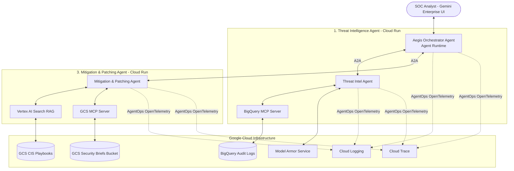

# Module 40: Advanced Capstone - Aegis Incident Response & AgentOps

## Theory & Architecture

### 1. The Scenario: Enterprise Security Operations & Threat Remediation
In a modern enterprise security operations center (SOC), analysts are overwhelmed by the sheer volume of system audit logs, security alerts, and vulnerability notices. Sifting through BigQuery access logs, cross-referencing system vulnerabilities with the NIST/CVE database, and drafting actionable mitigation playbooks is slow, manual, and prone to human error.

### 2. The Solution: Aegis Incident Response System (AIRS)
To solve this, you will implement an advanced, distributed multi-agent system called **Aegis Incident Response System (AIRS)**. This is a secure, automated threat hunting and patching coordinator built with **ADK 2.0**, integrated with Model Context Protocol (MCP) servers, Model Armor, Vertex AI Search (RAG), and a complete **AgentOps Observability Suite** (OpenTelemetry, Cloud Logging, and Cloud Trace).

---

## The Three Cooperative Agents & AgentOps

### 1. Threat Intelligence Agent (A2A Server on Cloud Run)
Acts as an automated log investigator and threat hunter.
*   **MCP Log Hunting:** Connects to a hosted **BigQuery MCP Server** to query database security audits, login logs, and IAM modifications.
*   **Data Masking (Model Armor):** Prior to outputting threat details, it uses **Model Armor** to scan and mask sensitive internal configuration keys, passwords, and private IP addresses, preventing data leaks.
*   **AgentOps Metrics:** 
    *   Traces log-query execution times.
    *   Logs specific database search latency.
    *   Exports token usage counts directly to Cloud Logging for custom metrics visualization.

### 2. Aegis Orchestrator Agent (Orchestrator on Agent Runtime)
The central dispatch system for SOC analysts, exposed securely via **Gemini Enterprise**.
*   **Coordination:** It acts as an A2A client that calls the Threat Intelligence and Mitigation agents as tools.
*   **Command Scope:** Understands commands like:
    *   *"Detect any brute-force attacks on our billing databases and generate patching plans."*
    *   *"Remediate recent SQL injection risks in the mid-market segment logs."*
*   **AgentOps Observability (Handoff Tracing):**
    *   Integrates **OpenTelemetry** to trace the parent-child span hierarchy. When the orchestrator calls a remote A2A agent, it injects trace headers so Cloud Trace displays the complete distributed trace of the multi-agent call stack.

### 3. Mitigation & Patching Agent (A2A Server on Cloud Run)
Compiles security advisories and automated patch scripts.
*   **Playbook Search (RAG):** Queries **Vertex AI Search (RAG)** linked to a GCS reference bucket containing CIS Controls, NIST playbooks, and company-approved security remediation standards.
*   **PDF Briefing & Signed GCS Upload:** Generates a customized executive security advisory and bash patching script, renders it as a **PDF**, and uses GCS MCP to obtain a signed URL to upload it to the secure Aegis bucket.

---

## AgentOps Deep-Dive: System Observability in Production

Implementing multi-agent systems in production requires robust **AgentOps** practices to track system performance, debug failures, and monitor costs:

1.  **Distributed Trace Propagation:**
    A2A agents communicate over HTTP. To see a unified timeline of a request, we propagate trace contexts across agent boundaries using standard W3C Trace Context headers. This links the user chat span to database queries and GCS uploads in a single trace tree.
2.  **Telemetry Hooks:**
    Using ADK 2.0 event hooks (`@agent.before_request`, `@agent.after_response`), we hook into agent execution lifecycles to automatically export:
    *   **LLM Latency:** Time taken by the model to generate responses.
    *   **Token Consumption:** Total input, output, and cached tokens per query.
    *   **Agent Handoffs:** Logs detailing when control shifted from the orchestrator to a remote A2A agent.
