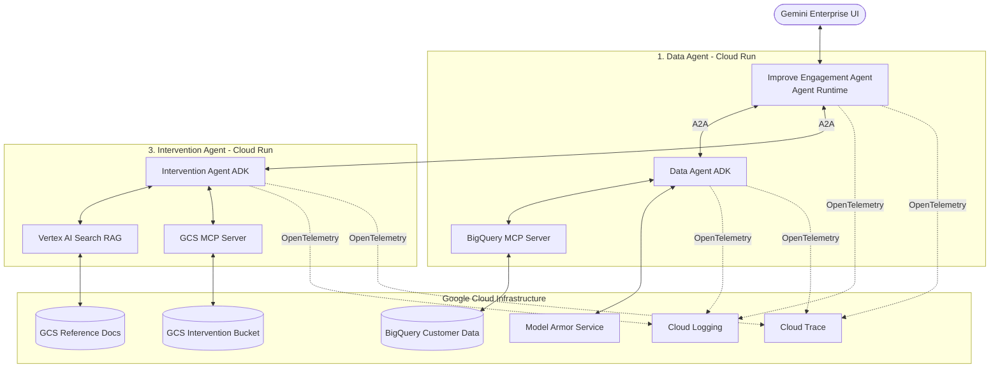

# Module 40: Advanced Capstone - Cymbal Enterprise Intervention

## Theory & Architecture

### 1. The Scenario: Cymbal Meet Churn Prevention
Cymbal Meet is an enterprise videoconferencing company that sells physical room devices and SaaS licenses to Enterprise, Mid-Market, and SMB customers. Like many SaaS companies, Cymbal Meet faces a critical challenge: when customers don't fully adopt the product, they are highly likely to **churn** at renewal time.

Today, identifying at-risk customers requires Customer Success Managers (CSMs) to manually query engagement tables, cross-reference open support cases, and craft individual outreach emails. This process is slow, inconsistent, and doesn't scale.

### 2. The Solution: Cymbal Customer Engagement Agent System
To solve this, you will implement an advanced, distributed multi-agent system composed of **three specialized cooperative agents** communicating via the **Agent-to-Agent (A2A)** protocol, integrated with Model Context Protocol (MCP) servers, Model Armor, and Google Cloud services.

---

## The Three Cooperative Agents

### 1. Data Agent (A2A Server on Cloud Run)
The **Data Agent** acts as a reusable data retrieval microservice. Its job is to answer natural language questions about customer engagement metrics stored in BigQuery.
*   **MCP Integration:** It connects to a hosted **BigQuery MCP Server** to discover schemas, interrogate metadata, and execute read-only queries dynamically using `gemini-3.5-flash`.
*   **Data Masking (Model Armor):** Before returning any database results to the caller, the agent intercepts the response and passes it to the **Model Armor Service** to sanitize sensitive data (specifically checking for and masking email addresses to protect user privacy).
*   **Security & Serving:** It is wrapped in an A2A serving container (`to_a2a()`), deployed to Cloud Run, and secured via IAM service accounts.

### 2. Improve Engagement Agent (Orchestrator on Agent Runtime)
The **Orchestrator** is the main user-facing agent exposed directly to CSMs via **Gemini Enterprise**.
*   **Command Parsing:** It understands user-facing commands such as:
    *   *"Build interventions for any customers with device performance issues."*
    *   *"Address all engagement issues in the SMB segment."*
*   **A2A Coordination:** It acts as an A2A client, consuming the Data Agent and the Intervention Agent as remote services.
    1.  First, it queries the **Data Agent** to find accounts with adoption shortfalls.
    2.  For each at-risk account found, it compiles an **Engagement Problem Profile** (including active metrics, churn risk, and support history).
    3.  It then calls the **Intervention Agent** to build and upload a personalized response.

### 3. Intervention Agent (A2A Server on Cloud Run)
The **Intervention Agent** is responsible for generating the actual business outreach asset.
*   **Semantic Search (RAG):** When presented with an Engagement Problem Profile, it triggers a semantic search inside **Vertex AI Search (RAG)** linked to a GCS bucket of "Customer Success Best Practices" and playbook documentation.
*   **Action Plan Generation:** It synthesizes the playbooks with the customer metrics to compose a tailored customer action plan and renders it as a professional **PDF**.
*   **Signed Upload (GCS MCP):** It connects to a **Cloud Storage MCP Server** to retrieve a secure, temporary *signed URL*, uploads the generated PDF to the Cymbal customer bucket, and returns the public link to the Orchestrator.

---

## Key Takeaways
1.  **A2A Microservices:** Isolating the **Data** and **Intervention** agents as separate A2A endpoints makes them reusable by other business units (e.g., automated emailers, billing, or sales dashboards).
2.  **MCP Isolation:** Using Model Context Protocol (MCP) servers decoupled from the LLM code prevents hard-coding database drivers or storage APIs inside the agent logic.
3.  **Enterprise Observability:** OpenTelemetry traces and logs propagate across all three services, allowing Cloud Trace to show the exact latency path of an orchestration cycle.
